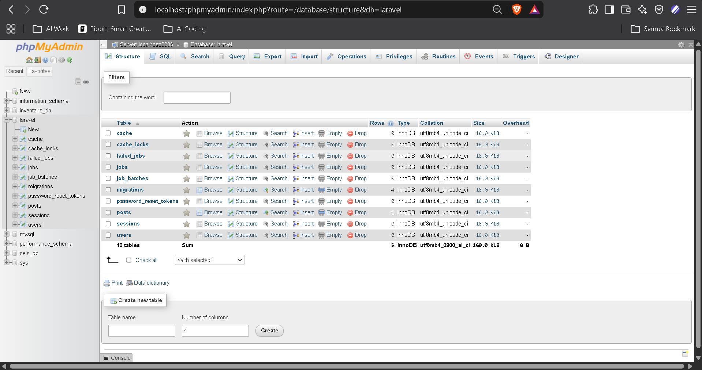

# Aplikasi Laravel: Tugas Praktik

**Pembuat:** Ahmad Al Banna   
**Framework:** Laravel 13.x  
**Bahasa:** PHP 8.5+

---

## 📌 Deskripsi Proyek

Aplikasi web berbasis Laravel yang mengimplementasikan konsep dasar framework Laravel termasuk routing, controller, model, view, dan database. Proyek ini mendemonstrasikan cara membuat aplikasi dengan beberapa halaman dinamis dan fitur bonus route parameter.

---

## ✅ Kriteria Wajib yang Terpenuhi

### 1. **Install Composer & Buat Project Laravel**

Menggunakan Composer untuk membangun project Laravel baru dengan template standar.


**Penjelasan:** Composer digunakan sebagai package manager PHP untuk mengunduh dan mengelola dependency Laravel. Setelah instalasi Composer, project Laravel dibuat dengan perintah `composer create-project laravel/laravel`.

---

### 2. **Konfigurasi .env dan Database**

Mengatur konfigurasi database di file `.env` sesuai dengan DBMS yang digunakan (MySQL/PostgreSQL).




**Penjelasan:** File `.env` berisi konfigurasi environment seperti nama database, username, password, dan host. Konfigurasi ini memungkinkan aplikasi terhubung dengan database secara dinamis tanpa hardcoding credential.

---

### 3. **Jalankan Server dengan `php artisan serve`**

Menjalankan development server Laravel di localhost.


**Penjelasan:** Perintah `php artisan serve` memulai built-in development server Laravel pada port 8000. Server ini memungkinkan testing aplikasi secara lokal sebelum deployment ke production.

---

### 4. **Buat 3 Route Custom**

Membuat tiga route custom untuk halaman home, about, dan contact.


**Route yang tersedia:**
- `GET /` → Home page
- `GET /about` → Halaman tentang aplikasi
- `GET /contact` → Halaman kontak
- `GET /posts` → Daftar semua posts
- `GET /hello/{nama}` → Route dengan parameter (BONUS)

**Implementasi di routes/web.php:**
```php
Route::get('/', [CustomController::class, 'home']);
Route::get('/about', [CustomController::class, 'about']);
Route::get('/contact', [CustomController::class, 'contact']);
Route::get('/posts', [CustomController::class, 'posts']);
Route::get('/hello/{nama}', [CustomController::class, 'hello']);
```

**Penjelasan:** Route didefinisikan di `routes/web.php` dan memetakan HTTP request ke method controller yang sesuai. Setiap route mengarahkan ke method controller yang sesuai untuk memproses request.

---

### 5. **Buat Controller dengan `php artisan make:controller`**

Membuat custom controller untuk menangani logika bisnis aplikasi.


**Controller yang dibuat:**
- `CustomController` → Menangani semua halaman custom (home, about, contact, posts, hello)

**Method di CustomController:**
```php
public function home()
{
    $pesan = "Selamat datang di halaman home!";
    return view('home', compact('pesan'));
}

public function about()
{
    $tentang = "Ini adalah halaman about aplikasi Laravel";
    return view('about', compact('tentang'));
}

public function contact()
{
    $kontak = ['email' => 'banna@example.com', 'phone' => '08123456789'];
    return view('contact', compact('kontak'));
}

public function posts()
{
    $posts = Post::all();
    return view('posts', ['posts' => $posts]);
}

public function hello($nama)
{
    return view('hello', compact('nama'));
}
```

**Penjelasan:** Controller berfungsi sebagai jembatan antara route dan view. Setiap method controller menerima request, memproses data, dan mengembalikan response (view) ke client.

---

### 6. **Buat Model dengan `php artisan make:model -m`**

Membuat model dan migration untuk tabel database.


**Model yang dibuat:**
- `Post` → Model untuk data post/artikel

**Struktur Model Post (app/Models/Post.php):**
```php
namespace App\Models;

use Illuminate\Database\Eloquent\Model;

class Post extends Model
{
    protected $fillable = ['judul', 'isi'];
}
```

**Migration tabel posts:**
```php
Schema::create('posts', function (Blueprint $table) {
    $table->id();
    $table->string('judul');
    $table->text('isi');
    $table->timestamps();
});
```

**Penjelasan:** Model merepresentasikan struktur data di database. Model Post berisi field `judul` dan `isi` yang dapat diisi (fillable) untuk insert/update data. Migration otomatis membuat tabel `posts` di database dengan struktur yang tepat.

---

### 7. **View Menampilkan Data Dinamis**

Semua view menampilkan data yang dikirim dari controller dengan Blade template.

**View yang tersedia:**

- **home.blade.php** → Menampilkan pesan home dinamis
- **about.blade.php** → Menampilkan informasi about
- **contact.blade.php** → Menampilkan data kontak
- **posts.blade.php** → Menampilkan daftar posts dari database
- **hello.blade.php** → Menampilkan nama dari route parameter (BONUS)

**Contoh Blade syntax di posts.blade.php:**
```blade
<h1>Semua Posts</h1>
@forelse($posts as $post)
    <div>
        <h2>{{ $post->judul }}</h2>
        <p>{{ $post->isi }}</p>
    </div>
@empty
    <p>Belum ada post.</p>
@endforelse
```

**Penjelasan:** Blade adalah template engine Laravel yang memudahkan menampilkan data PHP dengan syntax yang clean. Directive seperti `@forelse`, `{{ }}`, dan `@empty` membuat rendering data jauh lebih elegan dibanding echo PHP biasa.

---

### 8. **Route Dengan Database Query**

Route `/posts` mengambil semua data dari tabel `posts` database dan menampilkannya di view.

**Screenshot route posts:**


**Implementasi:**
```php
// Di CustomController.php
public function posts()
{
    $posts = Post::all();  // Query semua posts dari database
    return view('posts', ['posts' => $posts]);
}
```

**Penjelasan:** Menggunakan model Post untuk query data menggunakan Eloquent ORM, kemudian passing data ke view. Jika database kosong, view menampilkan pesan "Belum ada post." Eloquent ORM memudahkan query database tanpa perlu SQL manual.

---

## 🎁 Fitur Bonus: Route Parameter

Membuat route dinamis yang menerima parameter dari URL untuk personalisasi konten.

**Route definition:**
```php
Route::get('/hello/{nama}', [CustomController::class, 'hello']);
```

**Controller method:**
```php
public function hello($nama)
{
    return view('hello', compact('nama'));
}
```

**View (hello.blade.php):**
```blade
<h1>Halo, {{ $nama }}!</h1>
<p>Selamat belajar Laravel!</p>
<p>Route parameter berhasil: /hello/{{ $nama }}</p>
```

**Cara menggunakan:**
- Akses: `http://localhost:8000/hello/Banna` → Output: "Halo, Banna!"
- Akses: `http://localhost:8000/hello/John` → Output: "Halo, John!"
- Akses: `http://localhost:8000/hello/AnakaNyaKamu` → Output: "Halo, AnakaNyaKamu!"

**Penjelasan:** Route parameter memungkinkan nilai dinamis dari URL diterima oleh controller. Parameter `{nama}` ditangkap dari URL dan diteruskan ke method controller sebagai argument. Ini sangat berguna untuk filtering, pencarian, atau personalisasi data berdasarkan input user.

---

## 🚀 Panduan Menjalankan Proyek Secara Lokal

### Prerequisites
- PHP 8.5+ dengan extension: PDO, OpenSSL, Mbstring, Tokenizer, XML
- Composer (package manager PHP)
- MySQL 5.7+ atau MariaDB (atau DBMS pilihan)
- Git (opsional)

### Langkah-Langkah Setup Lengkap

#### 1. Clone atau Download Project
```bash
# Jika menggunakan git
git clone <repository-url> TR9_laravel

# Atau manual: copy folder project ke direktori web server
cd C:\laragon\www\TR9_laravel
```

#### 2. Install Dependencies dengan Composer
```bash
composer install
```
Composer akan mendownload semua package yang diperlukan termasuk Laravel core, Illuminate components, dan dependencies lainnya.

#### 3. Copy File .env
```bash
# Windows
copy .env.example .env

# Linux/Mac
cp .env.example .env
```
File `.env` berisi konfigurasi environment aplikasi.

#### 4. Generate Application Key
```bash
php artisan key:generate
```
Key ini digunakan untuk encryption dan security aplikasi.

#### 5. Konfigurasi Database di File .env
Edit file `.env` dan sesuaikan setting database:
```
DB_CONNECTION=mysql
DB_HOST=127.0.0.1
DB_PORT=3306
DB_DATABASE=tr9_laravel
DB_USERNAME=root
DB_PASSWORD=
```

#### 6. Buat Database
Buka MySQL admin tool (phpMyAdmin, MySQL Workbench, atau CLI):
```sql
CREATE DATABASE tr9_laravel;
```

Atau jalankan migration untuk membuat tabel otomatis:
```bash
php artisan migrate
```

#### 7. Jalankan Development Server
```bash
php artisan serve
```

Output akan menampilkan:
```
Laravel development server started: http://127.0.0.1:8000
```

#### 8. Akses Aplikasi di Browser
- Home: `http://localhost:8000/`
- About: `http://localhost:8000/about`
- Contact: `http://localhost:8000/contact`
- Posts: `http://localhost:8000/posts`
- Hello (Bonus): `http://localhost:8000/hello/Banna`

---

## 📁 Struktur Folder & Penjelasan

```
TR9_laravel/
├── app/
│   ├── Http/
│   │   ├── Controllers/
│   │   │   ├── Controller.php           (Base controller - class parent)
│   │   │   ├── CustomController.php     (Custom controller dgn logic bisnis)
│   │   │   └── PostController.php       (Controller khusus posts)
│   │   ├── Middleware/                  (Middleware - filter request)
│   │   ├── Requests/                    (Form request validation)
│   │   └── Resources/                   (API resource)
│   ├── Models/
│   │   ├── User.php                     (Model untuk users)
│   │   └── Post.php                     (Model untuk posts - DIGUNAKAN)
│   ├── Providers/                       (Service providers - bootstrap aplikasi)
│   ├── Events/                          (Event handling)
│   ├── Jobs/                            (Background jobs)
│   └── Exceptions/                      (Exception handling)
│
├── routes/
│   ├── web.php                          (Route HTTP untuk web - UTAMA)
│   ├── api.php                          (Route untuk API)
│   └── console.php                      (Command routing)
│
├── resources/
│   ├── views/
│   │   ├── home.blade.php               (View halaman home)
│   │   ├── about.blade.php              (View halaman about)
│   │   ├── contact.blade.php            (View halaman contact)
│   │   ├── posts.blade.php              (View daftar posts dari DB)
│   │   ├── hello.blade.php              (View bonus dgn parameter)
│   │   └── welcome.blade.php            (Default welcome page)
│   ├── css/
│   │   └── app.css                      (Stylesheet utama)
│   └── js/
│       └── app.js                       (JavaScript utama)
│
├── database/
│   ├── migrations/                      (File migrasi - schema database)
│   │   ├── 2019_12_14_create_users_table.php
│   │   ├── 2024_01_01_create_posts_table.php
│   │   └── 2024_01_01_create_password_reset_tokens_table.php
│   ├── factories/                       (Factory - generate dummy data)
│   │   ├── UserFactory.php
│   │   └── PostFactory.php
│   └── seeders/                         (Seeder - populate database)
│       └── DatabaseSeeder.php
│
├── storage/
│   ├── app/                             (User-generated files)
│   ├── logs/                            (Application logs)
│   └── framework/                       (Cache, sessions, views)
│
├── bootstrap/
│   └── app.php                          (Bootstrap aplikasi)
│
├── config/                              (Konfigurasi aplikasi)
│   ├── app.php                          (Config utama)
│   ├── database.php                     (Config database)
│   ├── cache.php                        (Config cache)
│   ├── mail.php                         (Config email)
│   └── ...
│
├── tests/                               (Unit & Feature tests)
│   ├── Unit/
│   └── Feature/
│
├── public/                              (Root directory akses web)
│   ├── index.php                        (Entry point aplikasi)
│   ├── css/                             (CSS compiled)
│   ├── js/                              (JS compiled)
│   └── ...
│
├── dokumentasi/                         (Screenshot dokumentasi tugas)
│   ├── Install composer.png
│   ├── Buat project.png
│   ├── konfigurasi .env db.png
│   ├── Database.png
│   ├── php artisan serve berjalan.png
│   ├── Tampilan welcome page.png
│   ├── makecontroller & makemodel -m.png
│   ├── array route.png
│   ├── ss route home.png
│   ├── ss route about.png
│   └── ss route contact.png
│
├── .env                                 (Environment variables - JANGAN COMMIT)
├── .env.example                         (Template .env)
├── .gitignore                           (File yang diabaikan git)
├── composer.json                        (Dependencies definition)
├── composer.lock                        (Lock dependencies ke versi spesifik)
├── artisan                              (Laravel CLI - command runner)
├── package.json                         (NPM packages)
├── vite.config.js                       (Vite bundler config)
└── README.md                            (Dokumentasi ini)
```

### Penjelasan Folder Utama

| Folder | Fungsi |
|--------|--------|
| `app/Http/Controllers` | Tempat semua controller - menghandle request logic dari route |
| `app/Models` | Tempat semua model - representasi struktur table database |
| `routes/web.php` | Definisi semua route web - memetakan URL ke controller method |
| `resources/views` | Tempat semua view Blade - template HTML dinamis |
| `database/migrations` | File blueprint untuk membuat/edit struktur database |
| `database/seeders` | File untuk populate database dengan dummy data |
| `config/` | Setting konfigurasi aplikasi (database, cache, mail, dll) |
| `storage/` | File logs, cache, sessions, dan user uploads |
| `public/` | Folder publik - file yang dapat diakses langsung dari browser |
| `bootstrap/` | File bootstrap - inisialisasi aplikasi |
| `tests/` | Test files - unit test dan feature test |

---

## 📊 Screenshot Dokumentasi

Semua screenshot implementasi dan bukti pemenuhan kriteria tersimpan di folder `dokumentasi/`:

| File | Keterangan |
|------|-----------|
| `Install composer.png` | Bukti instalasi Composer |
| `Buat project.png` | Bukti pembuatan project Laravel |
| `konfigurasi .env db.png` | Konfigurasi file .env untuk database |
| `Database.png` | Database yang telah dibuat |
| `php artisan serve berjalan.png` | Server development sedang berjalan |
| `Tampilan welcome page.png` | Halaman welcome page Laravel |
| `makecontroller & makemodel -m.png` | Pembuatan controller dan model dengan migration |
| `array route.png` | Daftar route yang tersedia di aplikasi |
| `ss route home.png` | Screenshot route home dalam aksi |
| `ss route about.png` | Screenshot route about dalam aksi |
| `ss route contact.png` | Screenshot route contact dalam aksi |

---

## 🔧 Testing Routes & Features

Untuk memastikan semua route berfungsi dengan benar, test menggunakan browser atau tools seperti Postman:

### Route Testing

```bash
# Test HOME - menampilkan halaman home dengan pesan dinamis
curl http://localhost:8000/

# Test ABOUT - menampilkan halaman about
curl http://localhost:8000/about

# Test CONTACT - menampilkan halaman contact dengan data array
curl http://localhost:8000/contact

# Test POSTS - menampilkan daftar posts dari database
curl http://localhost:8000/posts

# Test HELLO dgn parameter - BONUS FEATURE
curl http://localhost:8000/hello/Banna
curl http://localhost:8000/hello/John
curl http://localhost:8000/hello/Pembelajaran
```

### Seeding Database (Opsional)

Untuk menambahkan sample posts ke database:

```bash
php artisan db:seed
```

---

## 💻 Command Artisan yang Digunakan

Perintah Laravel CLI yang digunakan dalam proyek ini:

```bash
# Generate application key
php artisan key:generate

# Jalankan migration (buat tabel database)
php artisan migrate

# Seed database dengan dummy data
php artisan db:seed

# Jalankan development server
php artisan serve

# Buat controller baru
php artisan make:controller NamaController

# Buat model baru dengan migration
php artisan make:model NamaModel -m

# List semua route
php artisan route:list
```

---

## 💡 Teknologi yang Digunakan

- **Laravel 13.x** - PHP Web Application Framework
- **PHP 8.5+** - Backend Programming Language
- **MySQL 5.7+** - Database Management System
- **Blade** - Template Engine Laravel
- **Eloquent ORM** - Object-Relational Mapping
- **Composer** - PHP Package Manager
- **Vite** - Frontend build tool (optional)

---

## 📋 File Penting untuk Modifikasi

Jika ingin extend aplikasi:

1. **Tambah route baru** → Edit `routes/web.php`
2. **Tambah method controller** → Edit `app/Http/Controllers/CustomController.php`
3. **Tambah view baru** → Buat file `.blade.php` di `resources/views/`
4. **Tambah model baru** → Jalankan `php artisan make:model NamaBaru -m`
5. **Konfigurasi database** → Edit file `.env`
6. **Konfigurasi aplikasi** → Edit file di `config/`

---

## 📝 Catatan Penting

Proyek ini merupakan implementasi educational dari konsep-konsep dasar Laravel. Untuk production use, tambahkan:

- ✅ **Authentication & Authorization** - Sistem login & permission
- ✅ **Input Validation** - Validasi form input
- ✅ **Error Handling** - Exception handling yang proper
- ✅ **Unit Tests** - Test automation dengan PHPUnit
- ✅ **Security Hardening** - CSRF protection, XSS prevention, SQL injection protection
- ✅ **API Documentation** - Jika API route diperlukan
- ✅ **Logging** - Activity logging untuk debugging
- ✅ **Rate Limiting** - Proteksi dari brute force attacks

---

## ✨ Status Pemenuhan

| Kriteria | Status | Evidence |
|----------|--------|----------|
| Install Composer & Buat Project | ✅ | `Buat project.png` |
| Konfigurasi .env & Database | ✅ | `konfigurasi .env db.png`, `Database.png` |
| Jalankan `php artisan serve` | ✅ | `php artisan serve berjalan.png` |
| 3 Route Custom | ✅ | `array route.png` |
| Controller (make:controller) | ✅ | `makecontroller & makemodel -m.png` |
| Model & Migration (make:model -m) | ✅ | `makecontroller & makemodel -m.png` |
| View Dinamis | ✅ | `ss route home.png`, `ss route about.png`, `ss route contact.png` |
| Route dengan Database Query | ✅ | `posts.blade.php` menggunakan `Post::all()` |
| **BONUS: Route Parameter** | ✅ | `/hello/{nama}` route implemented |

---

## 🎯 Kesimpulan

Aplikasi Laravel ini telah berhasil mengimplementasikan semua kriteria wajib:
- ✅ Setup dan konfigurasi project
- ✅ 3 route custom dengan controller methods
- ✅ Model dan database integration
- ✅ View rendering dengan data dinamis
- ✅ Bonus feature: route parameter

Semua file, konfigurasi, dan documentation telah disiapkan untuk mendemonstrasikan pemahaman mendalam tentang Laravel framework dan konsep-konsep dasar web development.

---

**Cuma Tugas Setup laravel yang baik dan benar! 🚀**
